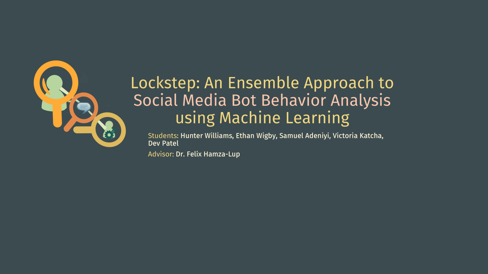
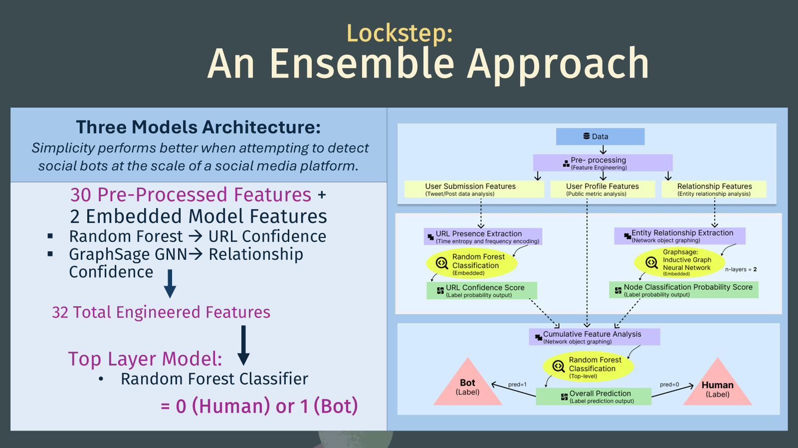
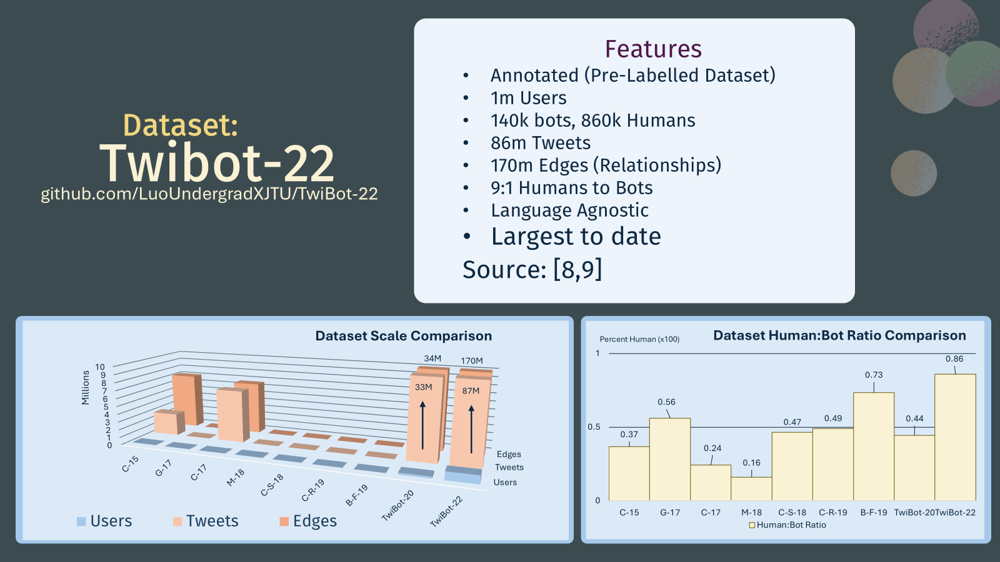
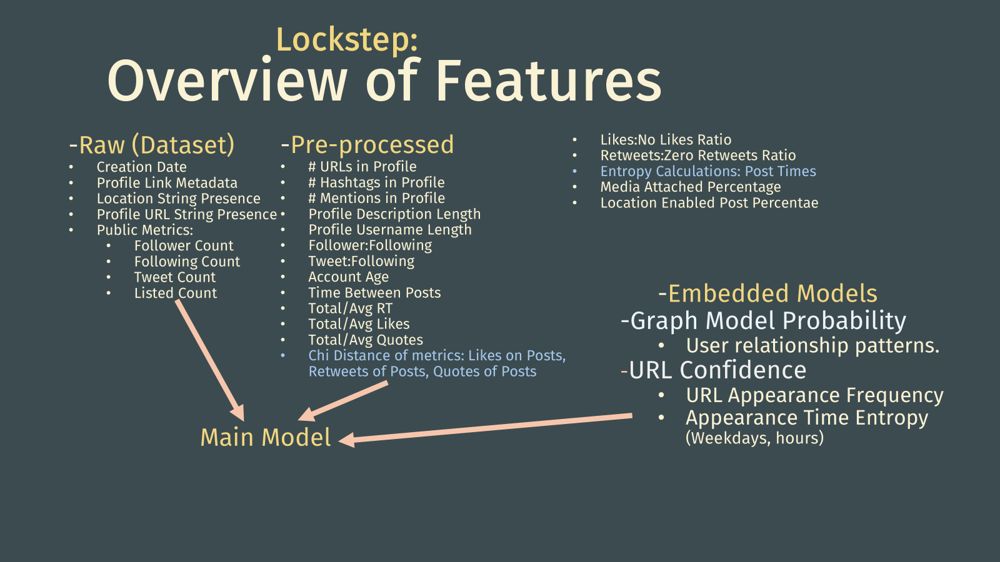
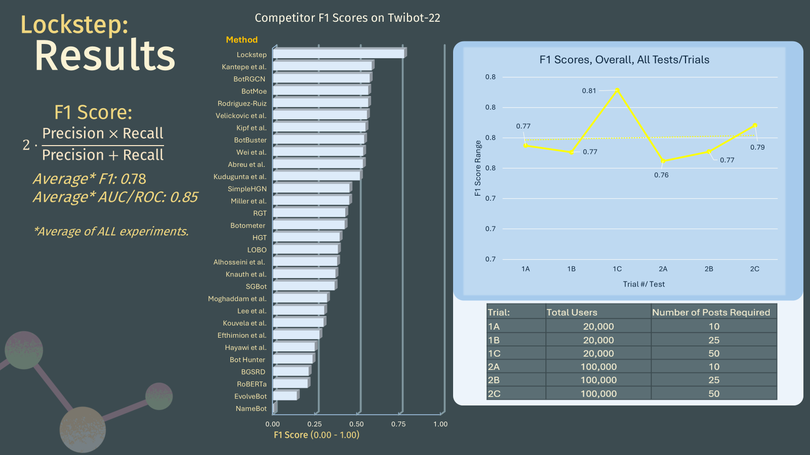

# Lockstep: An ensemble method for social bot behavior detection on internet social media
#
## Original December 2024 Project Presented at the HL-GA Battery Expo in Statesboro, GA

# Summary

Lockstep uses machine learning models to determine whether a user interacting on a social media site is displaying behavior that is similar to the behavior displayed by known bots. The focal idea of Lockstep is in the simplicity of and the ability to scale the architecture used in lockstep. A benefit of this simplicity is being closer to the position of being able to 'interpret' decisions made by the chosen algorithms.

# Dataset

Lockstep was trained on Twibot-22.
@ https://github.com/LuoUndergradXJTU/TwiBot-22

# Models

Lockstep utilizes fine-tuned Random Forest models and a graph neural network 'GraphSage' to make predictions on features.

# Results

The original model performed well on it's task versus competitors.

